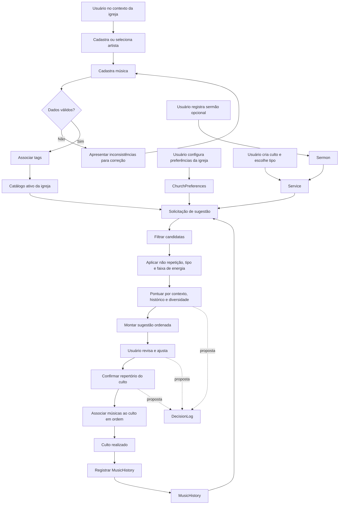

# LOUVOR INTELIGENTE — Fluxo de Dados da Versão 1.0

> Fluxo implementado: gerar sugestão → salvar rascunho → confirmar → executar → registrar histórico automático → atualizar consultas do dashboard.

## Propósito e limites

Este documento descreve o caminho dos dados desde o cadastro de uma música até sua seleção e registro histórico. É documentação de comportamento esperado; não cria fluxos executáveis, endpoints, tabelas ou telas.

O fluxo usa como base o modelo aprovado em `PROJECT.md` e o vocabulário de domínio de `DOMAIN.md`. A persistência de `DecisionLog` é uma proposta pendente de aprovação: por isso, aparece como etapa opcional de rastreabilidade, nunca como pré-requisito de operação.

## Visão ponta a ponta

## Etapas detalhadas

### 1. Preparação do catálogo

1. O usuário atua dentro de uma `Church`.
2. Quando aplicável, ele localiza ou registra um `Artist`.
3. Ele cadastra uma `Music` com os metadados disponíveis, definindo obrigatoriamente tipo (`HINO` ou `LOUVOR`) e energia (1 a 5).
4. O sistema valida regras do domínio: música pertence à igreja, tipo permitido, energia no intervalo e valores numéricos positivos quando informados.
5. O usuário associa uma ou mais `Tag` usando `MusicTag`.
6. A música fica disponível ao algoritmo somente se estiver ativa.

**Saída:** catálogo pesquisável de músicas elegíveis, artistas e tags.

### 2. Configuração dos critérios da igreja

1. A igreja mantém uma instância de `ChurchPreferences`.
2. Ela informa quantidade desejada de hinos e louvores, dias sem repetição e faixa de energia.
3. O sistema valida a consistência: valores não negativos e energia mínima menor ou igual à máxima.

**Saída:** parâmetros que o algoritmo utilizará como limites e preferências.

### 3. Contextualização do culto

1. O usuário cria um `Service` para uma `Church`, definindo data e `ServiceType`.
2. Opcionalmente, registra um `Sermon` com tema, referência bíblica e pregador.
3. Tags ou filtros informados pelo usuário podem complementar o contexto; essa é uma interação de uso, não uma alteração de modelo de dados.

**Saída:** contexto de seleção que combina tipo de culto, data, preferências e tema quando existir.

### 4. Busca de candidatas

1. O algoritmo carrega somente `Music` ativa da igreja do culto.
2. Aplica filtros explícitos do planejamento: tipo, tags, tonalidade, BPM ou outros critérios que já existam no catálogo.
3. Se existir `Sermon`, o tema pode orientar tags desejadas; a ausência de tags correspondentes não deve impedir a sugestão por si só.
4. O algoritmo consulta `MusicHistory` para identificar a última execução de cada candidata.

**Saída:** conjunto de candidatas que atende aos filtros mínimos.

### 5. Regras de elegibilidade e pontuação

1. Candidatas utilizadas dentro de `dias_sem_repetir` são excluídas ou penalizadas conforme a regra aprovada para o algoritmo.
2. Candidatas fora da faixa `energia_minima`–`energia_maxima` são excluídas ou tratadas conforme eventual exceção aprovada.
3. As candidatas restantes são separadas por `HINO` e `LOUVOR`.
4. O algoritmo busca as quantidades configuradas para cada tipo.
5. Cada candidata recebe pontuação explicável baseada em:
   - aderência ao contexto (tags, tema e tipo de culto);
   - tempo desde a última execução;
   - diversidade de artista e tags;
   - adequação da energia;
   - penalidade de repetição.
6. O sistema ordena a sugestão para formar uma progressão de energia coerente.

**Saída:** sugestão editável de repertório, com critérios que possam ser apresentados ao usuário.

### 6. Revisão e confirmação humana

1. O usuário revisa a sugestão.
2. Ele pode incluir, remover, substituir, alterar tonalidade de execução ou reordenar músicas.
3. Ao confirmar, as músicas e suas posições são associadas ao `Service` pela estrutura de repertório já definida no `PROJECT.md`.
4. A confirmação do usuário prevalece sobre a sugestão automática.

**Saída:** repertório confirmado para o culto, ainda distinto de histórico de execução.

### 7. Registro histórico

1. Após o culto, o usuário confirma quais músicas foram efetivamente executadas.
2. Para cada música executada, o sistema cria um `MusicHistory` no contexto do `Service` e da `Church`.
3. Esse histórico passa a ser usado na próxima execução do algoritmo.

**Saída:** memória de uso real, preservada mesmo que a música seja desativada futuramente.

## Decisões e exceções no fluxo

| Situação | Comportamento esperado | Justificativa |
| --- | --- | --- |
| Nenhuma candidata atende integralmente às preferências | Informar insuficiência e permitir ajuste humano | A recomendação não deve bloquear o planejamento. |
| Música ativa foi usada recentemente | Excluir ou penalizar conforme regra aprovada | Evita repetição excessiva sem impedir exceções pastorais/litúrgicas. |
| Música está inativa | Não usar em novas sugestões | Mantém o catálogo histórico sem ampliar o repertório ativo. |
| Sermão não foi informado | Gerar sugestão usando tipo de culto e preferências | O fluxo precisa funcionar para planejamentos sem pregação definida. |
| Usuário altera sugestão | Preservar ajuste como decisão humana | A responsabilidade final pertence ao ministério. |
| Música foi sugerida, mas não tocada | Não criar `MusicHistory` | Sugestão não equivale a execução. |

## Ponto de controle: DecisionLog

**Proposta pendente de aprovação:** registrar no `DecisionLog` a origem da escolha (algoritmo ou usuário), critérios aplicados, músicas descartadas por repetição e ajustes manuais. Isso aumenta a confiança e permite explicar recomendações, mas requer aprovação por introduzir uma nova estrutura de persistência.

Até essa aprovação, o fluxo operacional permanece completo sem `DecisionLog`.
