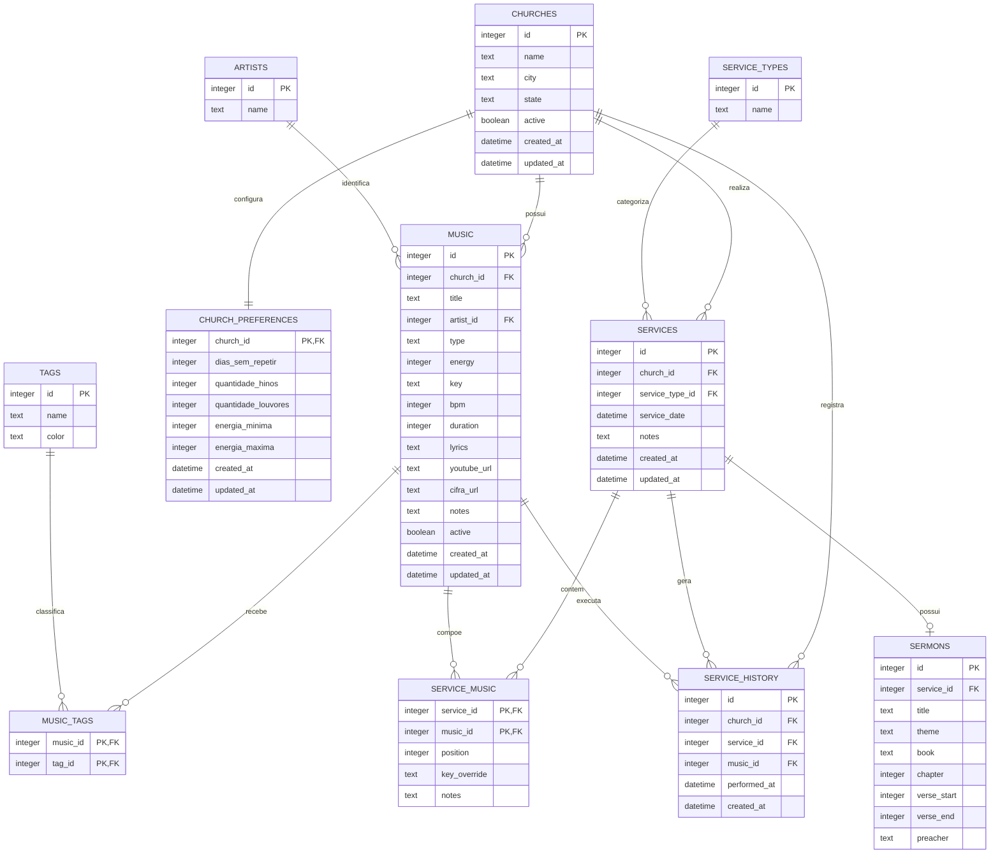

# LOUVOR INTELIGENTE — Arquitetura 2.0

> Status de implementação: MVP com catálogo, cultos, motor de sugestão, repertórios, histórico, dashboard e interface estática responsiva. A primeira versão usa contexto único de igreja no backend; a modelagem permanece preparada para multiigreja.

## 1. Objetivo do sistema

**Louvor Inteligente** é um sistema web para organizar o catálogo musical, planejar cultos e sugerir repertórios para igrejas. A primeira implantação atenderá a Igreja Presbiteriana Independente de Vila São José, em Osasco–SP. A arquitetura mantém o isolamento por igreja para permitir a evolução segura para múltiplas organizações.

O sistema apoia a decisão do responsável pelo louvor: sugestões são editáveis e a confirmação humana sempre prevalece.

## 2. Tecnologias

| Camada | Tecnologia | Responsabilidade |
| --- | --- | --- |
| Runtime | Node.js | Execução do servidor. |
| Backend | Express | API HTTP, middleware e entrega de arquivos estáticos. |
| Persistência | SQLite | Banco de dados inicial, portátil e simples de operar. |
| Frontend | HTML5, CSS3 e JavaScript puro | Interface e interações no navegador. |
| Interface visual | Bootstrap 5 | Layout responsivo e componentes. |
| Configuração | dotenv | Variáveis de ambiente fora do repositório. |

O acesso ao SQLite será encapsulado nos models. Assim, uma futura troca para PostgreSQL não deverá alterar controllers, services ou frontend.

## 3. Estrutura de pastas

```text
louvor-inteligente/
├── backend/
│   ├── controllers/       # Orquestra requisições e respostas HTTP
│   ├── database/          # Conexão, schema, migrações e arquivo SQLite
│   ├── middleware/        # Autenticação, validação e erros
│   ├── models/            # Persistência e consultas por entidade
│   ├── routes/            # Endpoints da API
│   ├── services/          # Regras de negócio e sugestão de repertório
│   └── utils/             # Funções auxiliares sem estado
├── frontend/
│   ├── assets/
│   │   ├── css/           # Estilos
│   │   ├── img/           # Recursos visuais
│   │   └── js/            # Scripts de interface e cliente HTTP
│   ├── pages/             # Páginas secundárias
│   └── index.html         # Dashboard
├── .env.example
├── .gitignore
├── app.js                 # Configuração do Express
├── server.js              # Inicialização HTTP
├── package.json
├── PROJECT.md             # Arquitetura e decisões técnicas
└── README.md              # Instruções de uso local
```

## 4. Arquitetura MVC com camada de serviços

```text
Frontend → Routes → Controllers → Services → Models → SQLite
                                        ↓
                                  Regras de negócio
```

- **Routes:** associam método e URL aos controllers.
- **Controllers:** recebem a requisição, validam formato básico, chamam services e definem a resposta HTTP.
- **Services:** aplicam regras de negócio, incluindo filtros e pontuação do repertório.
- **Models:** são a única camada que consulta ou altera o banco.
- **Middleware:** lida com responsabilidades transversais, como autenticação, validação e erros.
- **Frontend:** consome a API e não contém regras de domínio.

## 5. Fluxo do sistema

1. A igreja mantém o catálogo único de itens musicais (`music`), classificando cada item como `HINO` ou `LOUVOR`.
2. Artistas e tags são associados aos itens para facilitar filtro, pesquisa e seleção.
3. A igreja configura preferências de repetição, quantidades por tipo e faixa de energia.
4. Ao planejar um culto, o usuário seleciona tipo, data e contexto; opcionalmente registra a pregação.
5. O serviço de repertório filtra e pontua músicas elegíveis conforme o contexto e as preferências.
6. O usuário revisa, ajusta e confirma o repertório do culto.
7. As músicas confirmadas são registradas no histórico e passam a influenciar sugestões futuras.

## 6. Módulos

| Módulo | Responsabilidade |
| --- | --- |
| Dashboard | Visão geral, atalhos e indicadores futuros. |
| Igrejas | Identidade e isolamento dos dados de cada organização. |
| Catálogo musical | Gestão de músicas e hinos na tabela única `music`. |
| Artistas | Cadastro de autores, intérpretes ou bandas. |
| Tags | Classificação livre e visual dos itens musicais. |
| Tipos de culto | Cadastro de contextos como Santa Ceia, Natal e Missões. |
| Cultos e pregações | Planejamento de cultos e vínculo com informações de sermão. |
| Repertórios | Seleção, ordenação e confirmação das músicas de um culto. |
| Histórico | Consulta e análise das músicas efetivamente utilizadas. |
| Preferências | Critérios específicos de seleção por igreja. |

## 7. Banco de dados

### 7.1 Princípios de modelagem

- Há uma única tabela de catálogo: **`music`**. Não existirão tabelas separadas para hinos e músicas.
- O campo `music.type` define o tipo do item: somente `HINO` ou `LOUVOR`.
- Todo dado operacional é isolado por `church_id` quando pertence a uma igreja.
- Chaves estrangeiras devem ser ativadas no SQLite (`PRAGMA foreign_keys = ON`).
- Datas serão persistidas em ISO 8601 (`YYYY-MM-DD` ou `YYYY-MM-DDTHH:mm:ssZ`).
- `active` será booleano lógico, persistido como `0` ou `1` no SQLite.

### 7.2 Entidades

| Tabela | Finalidade |
| --- | --- |
| `churches` | Igrejas atendidas pelo sistema. |
| `artists` | Artistas, autores, intérpretes ou bandas do catálogo. |
| `tags` | Etiquetas reutilizáveis com identificação visual por cor. |
| `music` | Catálogo único de hinos e louvores. |
| `music_tags` | Relação N:N entre músicas e tags. |
| `church_preferences` | Parâmetros de seleção específicos de cada igreja. |
| `service_types` | Tipos de culto disponíveis para planejamento. |
| `services` | Instâncias de cultos planejados ou realizados. |
| `sermons` | Informações da pregação vinculadas a um culto. |
| `service_music` | Itens e ordem do repertório de um culto. |
| `service_history` | Registro histórico das músicas utilizadas. |

`services` e `service_music` são tabelas de apoio necessárias para representar, respectivamente, o `service_id` solicitado em `sermons` e a composição ordenada de um repertório. Elas não substituem nem duplicam `music`.

### 7.3 Definição das tabelas

#### `churches`

| Campo | Tipo lógico | Regras |
| --- | --- | --- |
| `id` | inteiro | Chave primária. |
| `name` | texto | Obrigatório. |
| `city` | texto | Opcional. |
| `state` | texto | Opcional. |
| `active` | booleano | Obrigatório; padrão ativo. |
| `created_at` | data/hora | Obrigatório. |
| `updated_at` | data/hora | Obrigatório. |

#### `artists`

| Campo | Tipo lógico | Regras |
| --- | --- | --- |
| `id` | inteiro | Chave primária. |
| `name` | texto | Obrigatório e único. |

#### `tags`

| Campo | Tipo lógico | Regras |
| --- | --- | --- |
| `id` | inteiro | Chave primária. |
| `name` | texto | Obrigatório e único. |
| `color` | texto | Obrigatório; cor CSS/hexadecimal válida definida pela aplicação. |

#### `music`

| Campo | Tipo lógico | Regras |
| --- | --- | --- |
| `id` | inteiro | Chave primária. |
| `church_id` | inteiro | Obrigatório; FK para `churches.id`. |
| `title` | texto | Obrigatório. |
| `artist_id` | inteiro | Opcional; FK para `artists.id`. |
| `type` | texto | Obrigatório; apenas `HINO` ou `LOUVOR`. |
| `energy` | inteiro | Obrigatório; valor inteiro de 1 a 5. |
| `key` | texto | Opcional; tonalidade principal. |
| `bpm` | inteiro | Opcional; deve ser positivo quando informado. |
| `duration` | inteiro | Opcional; duração em segundos, positiva quando informada. |
| `lyrics` | texto | Opcional. |
| `youtube_url` | texto | Opcional; URL válida quando informada. |
| `cifra_url` | texto | Opcional; URL válida quando informada. |
| `notes` | texto | Opcional; observações internas. |
| `active` | booleano | Obrigatório; padrão ativo. |
| `created_at` | data/hora | Obrigatório. |
| `updated_at` | data/hora | Obrigatório. |

Índice recomendado: `church_id, active, type` para a filtragem do algoritmo. A unicidade de título pode ser decidida por igreja mais adiante, pois versões distintas podem compartilhar nome.

#### `music_tags`

| Campo | Tipo lógico | Regras |
| --- | --- | --- |
| `music_id` | inteiro | FK para `music.id`. |
| `tag_id` | inteiro | FK para `tags.id`. |

Chave primária composta: (`music_id`, `tag_id`). Esta é a relação muitos-para-muitos entre itens musicais e tags.

#### `church_preferences`

| Campo | Tipo lógico | Regras |
| --- | --- | --- |
| `church_id` | inteiro | Chave primária e FK para `churches.id`; uma configuração por igreja. |
| `dias_sem_repetir` | inteiro | Obrigatório; mínimo 0. |
| `quantidade_hinos` | inteiro | Obrigatório; mínimo 0. |
| `quantidade_louvores` | inteiro | Obrigatório; mínimo 0. |
| `energia_minima` | inteiro | Obrigatório; entre 1 e 5. |
| `energia_maxima` | inteiro | Obrigatório; entre 1 e 5 e maior ou igual à mínima. |
| `created_at` | data/hora | Obrigatório. |
| `updated_at` | data/hora | Obrigatório. |

Os nomes dos campos permanecem em português por solicitação de domínio; na API e no código, a mesma nomenclatura deverá ser aplicada de forma consistente.

#### `service_types`

| Campo | Tipo lógico | Regras |
| --- | --- | --- |
| `id` | inteiro | Chave primária. |
| `name` | texto | Obrigatório e único. |

Carga inicial obrigatória: `Culto Normal`, `Santa Ceia`, `Batismo`, `Natal`, `Páscoa`, `Missões`, `Jovens`, `Mulheres`, `Homens` e `Evangelístico`.

#### `services`

| Campo | Tipo lógico | Regras |
| --- | --- | --- |
| `id` | inteiro | Chave primária. |
| `church_id` | inteiro | Obrigatório; FK para `churches.id`. |
| `service_type_id` | inteiro | Obrigatório; FK para `service_types.id`. |
| `service_date` | data/hora | Obrigatório. |
| `notes` | texto | Opcional. |
| `created_at` | data/hora | Obrigatório. |
| `updated_at` | data/hora | Obrigatório. |

#### `sermons`

| Campo | Tipo lógico | Regras |
| --- | --- | --- |
| `id` | inteiro | Chave primária. |
| `service_id` | inteiro | Obrigatório e único; FK para `services.id`. |
| `title` | texto | Opcional. |
| `theme` | texto | Opcional. |
| `book` | texto | Opcional. |
| `chapter` | inteiro | Opcional; positivo quando informado. |
| `verse_start` | inteiro | Opcional; positivo quando informado. |
| `verse_end` | inteiro | Opcional; maior ou igual a `verse_start` quando ambos existirem. |
| `preacher` | texto | Opcional. |

`service_id` único estabelece uma relação de no máximo uma pregação por culto.

#### `service_music`

| Campo | Tipo lógico | Regras |
| --- | --- | --- |
| `service_id` | inteiro | FK para `services.id`. |
| `music_id` | inteiro | FK para `music.id`. |
| `position` | inteiro | Obrigatório; inteiro positivo e único por culto. |
| `key_override` | texto | Opcional; tonalidade escolhida para aquele culto. |
| `notes` | texto | Opcional. |

Chave primária composta: (`service_id`, `music_id`). Deve existir também unicidade em (`service_id`, `position`).

#### `service_history`

| Campo | Tipo lógico | Regras |
| --- | --- | --- |
| `id` | inteiro | Chave primária. |
| `church_id` | inteiro | Obrigatório; FK para `churches.id`. |
| `service_id` | inteiro | Obrigatório; FK para `services.id`. |
| `music_id` | inteiro | Obrigatório; FK para `music.id`. |
| `performed_at` | data/hora | Obrigatório; data efetiva da execução. |
| `created_at` | data/hora | Obrigatório. |

Deve haver unicidade em (`service_id`, `music_id`) para impedir a duplicação do mesmo item no histórico de um único culto. Índice recomendado: (`church_id`, `music_id`, `performed_at`) para cálculo de recorrência.

### 7.4 Diagrama ER



## 8. Regras de negócio

1. Um item de `music` pertence a uma igreja e possui exatamente um `type`: `HINO` ou `LOUVOR`.
2. `energy` deve ser um inteiro entre 1 e 5.
3. Apenas músicas ativas podem ser sugeridas ou incluídas em novos cultos.
4. Música inativa continua acessível em registros históricos, preservando a integridade do passado.
5. `artist_id` é opcional; itens sem artista conhecido podem ser cadastrados.
6. Uma música pode possuir nenhuma, uma ou várias tags; a mesma tag não pode ser associada duas vezes à mesma música.
7. Cada igreja possui uma única configuração em `church_preferences`.
8. A faixa de energia configurada deve respeitar `energia_minima <= energia_maxima`.
9. Um culto deve ter igreja, tipo e data antes de receber um repertório confirmado.
10. A posição de cada música é única dentro de um culto.
11. O histórico deve ser criado apenas para músicas efetivamente confirmadas/executadas em um culto.
12. Todo `service_history.church_id` deve coincidir com a igreja do culto e da música; a camada de serviço garantirá essa consistência.
13. A pregação é opcional, mas quando existir estará associada a um único culto.
14. A sugestão automática é recomendação, nunca bloqueio: o responsável pode editar, remover, incluir e reordenar itens.

## 9. Algoritmo de escolha do repertório

O algoritmo residirá em `backend/services/` e operará por igreja e culto. Sua primeira versão seguirá as etapas:

1. Carregar `church_preferences` e o tipo de culto selecionado.
2. Selecionar itens ativos de `music` pertencentes à igreja.
3. Aplicar filtros de tipo, tags, tonalidade, energia e critérios informados pelo usuário.
4. Remover ou penalizar músicas usadas dentro de `dias_sem_repetir`, a partir de `service_history`.
5. Separar candidatos em `HINO` e `LOUVOR`.
6. Selecionar as quantidades definidas em `quantidade_hinos` e `quantidade_louvores`, respeitando `energia_minima` e `energia_maxima`.
7. Pontuar os candidatos por aderência a tags/tema, tempo sem execução, variedade de artista, diversidade de tags e distribuição de energia.
8. Ordenar os itens buscando progressão coerente de energia; a ordenação é sempre editável.
9. Persistir as escolhas confirmadas em `service_music` e, após o culto, em `service_history`.

Fórmula conceitual inicial:

```text
pontuacao = aderencia_ao_contexto + tempo_sem_execucao + diversidade
            + adequacao_de_energia - penalidade_de_repeticao
```

Os pesos serão configurações futuras, não valores fixos de código.

## 10. Funcionalidades futuras

- Autenticação, perfis e autorização por igreja.
- Gestão completa de igrejas e painel multiigreja.
- Cadastro de usuários e auditoria de alterações.
- Importação de catálogos por planilha.
- Pesquisa por letra, artista, tags, tonalidade, BPM e tipo.
- Templates de repertório por tipo de culto.
- Integrações com letras, cifras e plataformas de apresentação.
- Relatórios de recorrência, artistas, tags, energia e uso do catálogo.
- Exportação e impressão de repertórios.
- Escalas, colaboração, aprovação e notificações.
- Migração para banco de dados gerenciado em produção.

## 11. Convenções de código

- Nomes de código, arquivos e endpoints em inglês; conteúdo de interface em português brasileiro.
- O schema de dados seguirá os nomes de tabela e colunas descritos neste documento; nomes de preferências permanecem em português por regra de domínio.
- Arquivos e pastas em `kebab-case`; variáveis e funções em `camelCase`; classes em `PascalCase`.
- Controllers não consultam o banco diretamente e models não contêm regra de negócio.
- Endpoints usam substantivos no plural, por exemplo `/api/music` e `/api/service-types`.
- Respostas da API usam JSON, códigos HTTP semânticos e estrutura consistente de erro.
- Segredos ficam somente no `.env`; o repositório mantém apenas `.env.example`.
- Comentários explicam decisões e contexto, não instruções óbvias do código.

## 12. Padrão de commits

O projeto adotará **Conventional Commits**:

```text
tipo(escopo): descrição curta em português
```

- `feat`: funcionalidade nova.
- `fix`: correção de defeito.
- `docs`: documentação.
- `style`: formatação sem alterar comportamento.
- `refactor`: melhoria estrutural sem nova funcionalidade.
- `test`: inclusão ou ajuste de testes.
- `chore`: dependências, configuração ou manutenção.

Exemplos: `docs: atualiza arquitetura para versão 2.0` e `feat(music): cria catálogo unificado`.

## 13. Checklist do projeto

### Documentação e fundação

- [x] Definir escopo, tecnologias e arquitetura MVC.
- [x] Criar a estrutura física inicial do backend e frontend.
- [x] Configurar o Express para servir arquivos estáticos.
- [x] Criar a interface inicial sem regras de negócio.
- [x] Documentar o modelo unificado `music`.
- [x] Documentar relações, restrições e diagrama ER da versão 2.0.

### Próximas etapas — ainda não implementadas

- [ ] Revisar e aprovar o schema V2.
- [ ] Criar migrações SQLite, índices e carga inicial de `service_types`.
- [ ] Implementar conexão com banco e models.
- [ ] Implementar API de artistas, tags e catálogo musical.
- [ ] Implementar cultos, sermões, repertórios e histórico.
- [ ] Implementar preferências e algoritmo de sugestão.
- [ ] Implementar autenticação e isolamento de acesso por igreja.
- [ ] Criar testes automatizados, backup e preparação de produção.
